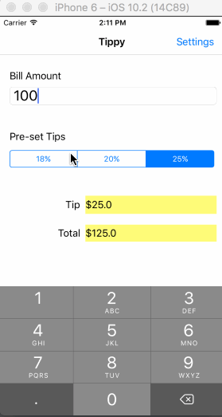

# tippy
This is a Tip Calculator application for iOS submitted as the pre-course requirement for Codepath.

Time spent: About 6 hours

Required:

* [x] Required: (Tip)ViewController and the SettingsViewController
* [x] Required: User can enter a bill amount, choose a tip percentage, and see the tip and total values.
* [x] Required: Settings page to change the default tip percentage, and choose between the default, light or dark themes for the Settings View

Optional:

* [x] Optional: UI animations, when user enters a bill amount, then there is a "shake" animation introduced to the Total amount. This will draw the user's attention to the total amount.
* [x] Optional: Remembering the bill amount and default tip percent values across app restarts (if less than 10mins)
* [x] Optional: Using locale-specific currency, currency thousands separators and percent formatters.

Additional: 

* [x] Additional: Making sure the keyboard is always visible and setting the bill amount text field is always the first responder by calling it from 'viewDidAppear'
* [x] Additional: Theming the Settings page, allowing the user to switch between the default, light and dark themes. Choosing the theme changes the view background and tint color

## Walkthrough of all user stories

Walkthrough: General                                |  Walkthrough: Locales, app restarts
:--------------------------------------------------:|:---------------------------------------------------:
  |  

GIF created with [LiceCap](http://www.cockos.com/licecap/).
